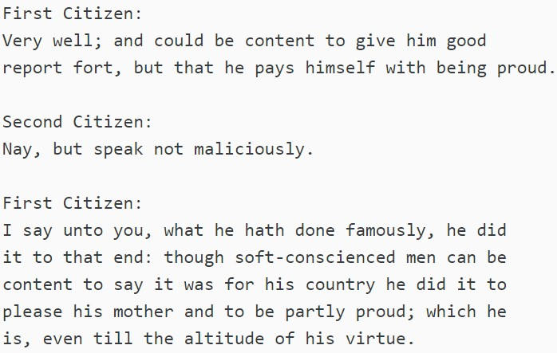
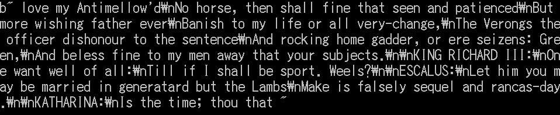
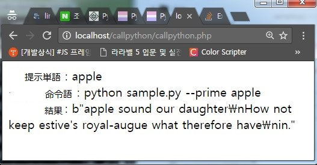

プロジェクト名｜
小説予想 AI

開発期間 / 開発人員｜
2017. 7. 1 ~ 2017. 8. 2( 1ヶ月 )
 　/　 1人

開発環境｜
Python, Tensorflow

概要｜

- 小説の内容ご学習させ、ある単語を提示する時、似合う内溶を予想する。
- 連続的なデータを学習させるため、RNNモデルを適用。

機能説明

- 学習のたのデータ

- 予想データ

- 単語を提示する時の予想データ

